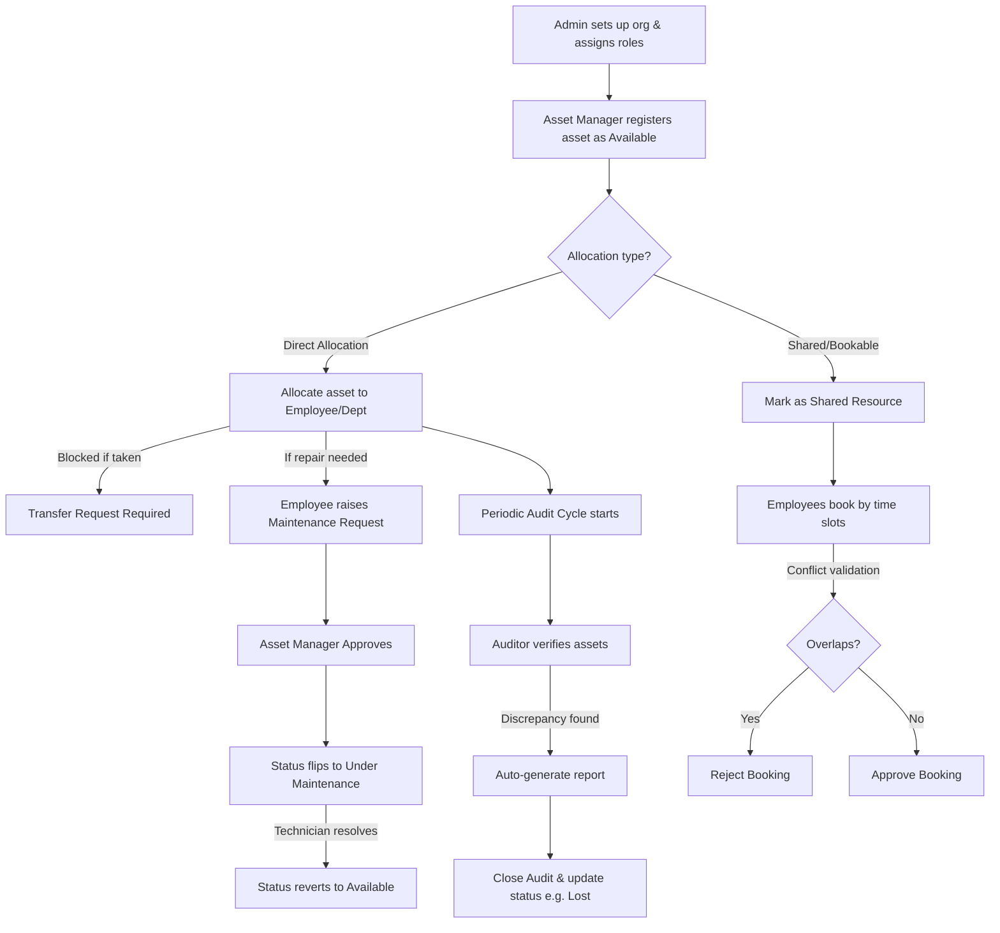

# AssetFlow 🚀

## Enterprise Asset & Resource Management System
*Developed for the **Odoo Hackathon***

---

### 👥 Team Info (Team Terminal)
* **Team Name**: Team Terminal
* **Event**: Odoo Hackathon
* **Team Members**:
  * **Darshil** (Lead)
  * **Keshvi**
  * **Prachi**
  * **Rudra**

---

### 🌐 Overall Vision
The vision for **AssetFlow** is to simplify and digitize how organizations track, allocate, and maintain their physical assets and shared resources through a centralized ERP platform. This is not tied to any single industry; any organization with equipment, furniture, vehicles, or shared spaces (offices, schools, hospitals, factories, agencies) can use it.

The platform aims to reduce manual tracking inefficiencies (spreadsheets, paper logs) by enabling structured asset lifecycles, centralized resource booking, and real-time visibility into who holds what, where it is, and its condition.

AssetFlow focuses on delivering core ERP functionality with clean architecture, role-based workflows, and scalable module design without touching purchasing, invoicing, or accounting concerns.

---

### 🎯 Mission
The mission for the team is to build a user-centric, responsive application that simplifies asset and resource management for any organization. The platform should provide staff with intuitive tools to:
- Set up departments, asset categories, and the employee directory.
- Register and track assets through their full lifecycle.
- Allocate assets to employees/departments with conflict handling.
- Book shared resources (rooms, vehicles, equipment) without overlaps.
- Run a structured maintenance approval workflow.
- Run structured audit cycles to catch discrepancies.
- Get notified of overdue returns, bookings, and maintenance events.

---

### 📋 Problem Statement
Design and develop an Enterprise Asset & Resource Management System where organizations can:
* Maintain departments, asset categories, and an employee directory.
* Track assets through a flexible lifecycle (including states: `Available`, `Allocated`, `Reserved`, `Under Maintenance`, `Lost`, `Retired`, `Disposed`) where assets can transition between states (e.g. `Available` ↔ `Under Maintenance`, `Allocated` → `Available`).
* Allocate assets to employees/departments, with the system preventing double-allocation of a single asset.
* Book shared/limited resources by time slot, with overlap validation.
* Route maintenance requests through an approval workflow before repair work starts.
* Run scheduled audit cycles with assigned auditors and auto-generated discrepancy reports.
* Surface overdue returns, bookings, and maintenance activity through notifications and a KPI dashboard.

The application must demonstrate proper ERP architecture, reusable modules, secure role-based workflows (with realistic account creation, not self-assigned admin roles), and intuitive UI/UX while handling relationships between departments, employees, assets, bookings, maintenance requests, and audits.

---

### 🔑 User Roles

| Role | Responsibilities |
|---|---|
| **Admin** | Manages departments, asset categories, audit cycles, and employee/role assignments (Organization Setup). Views organization-wide analytics. |
| **Asset Manager** | Registers and allocates assets. Approves transfers, maintenance requests, and audit discrepancy resolution. Approves asset returns and condition check-in notes. |
| **Department Head** | Views assets allocated to their department. Approves allocation/transfer requests within their department. Books shared resources on behalf of the department. |
| **Employee** | Views assets allocated to them. Books shared resources. Raises maintenance requests. Initiates return/transfer requests. |

---

### 🔄 Basic Workflow

1. **Setup**: Admin sets up departments, asset categories, and promotes select employees to Department Head / Asset Manager.
2. **Registration**: Asset Manager registers a new asset, which enters the system as `Available`.
3. **Allocation**: Asset is allocated to an employee/department (blocked if already allocated — a transfer request is required instead) or marked as a shared bookable resource.
4. **Resource Booking**: Employees book shared resources by time slot; overlapping requests are rejected automatically.
5. **Maintenance**: If an asset needs repair, the holder raises a maintenance request, which must be approved before work begins and before the asset flips to `Under Maintenance`.
6. **Transfer/Return**: Assets are transferred or returned as needs change; overdue returns are flagged automatically.
7. **Audit**: Periodic audit cycles assign auditors, verify assets, and auto-generate discrepancy reports before closing.
8. **Logging**: All activity is tracked through notifications, logs, and reports.

---

### 🖥️ Features

#### 1. Login / Signup Screen
* **Purpose**: Authenticate users with realistic, non-self-elevating account creation.
* **Key Functionality**:
  * Signup creates an **Employee** account only (no role selection at signup).
  * Admin creates/promotes Department Heads and Asset Managers from the Employee Directory (see Screen 3).
  * Email & password login, forgot password, and session validation.

#### 2. Dashboard / Home Screen
* **Purpose**: Give every role a real-time operational snapshot.
* **Key Functionality**:
  * KPI cards: Assets Available, Assets Allocated, Maintenance Today, Active Bookings, Pending Transfers, Upcoming Returns.
  * Overdue returns (past Expected Return Date) highlighted separately from upcoming ones.
  * Quick actions: Register Asset, Book Resource, Raise Maintenance Request.

#### 3. Organization Setup Screen (Admin only - 3 tabs)
* **Purpose**: Maintain the master data everything else depends on.
* **Tab A - Department Management**:
  * Create/edit/deactivate department.
  * Assign Department Head, optional Parent Department (for hierarchy), Status (Active/Inactive).
* **Tab B - Asset Category Management**:
  * Create/edit categories (Electronics, Furniture, Vehicles, etc.).
  * Optional category-specific fields (e.g. warranty period for Electronics).
* **Tab C - Employee Directory**:
  * Name, Email, Department, Role, Status (Active/Inactive).
  * Admin promotes an Employee to Department Head or Asset Manager here — this is the only place roles are assigned.

#### 4. Asset Registration & Directory Screen
* **Purpose**: Register assets and search/track them centrally.
* **Key Functionality**:
  * **Register**: Name, Category (from Screen 3), auto-generated Asset Tag (e.g. `AF-0001`), Serial Number, Acquisition Date, Acquisition Cost (kept for ranking/reports only, not linked to accounting), Condition, Location, photo/documents, and "shared/bookable" flag.
  * **Search/filter**: Filter by Asset Tag, Serial Number, QR code, category, status, department, or location.
  * **Lifecycle status** shown per asset: `Available`, `Allocated`, `Reserved`, `Under Maintenance`, `Lost`, `Retired`, `Disposed`.
  * **Per-asset history**: allocation history + maintenance history.

#### 5. Asset Allocation & Transfer Screen
* **Purpose**: Manage who holds what, with explicit conflict rules.
* **Key Functionality**:
  * Allocate asset to employee/department with optional Expected Return Date.
  * **Conflict rule**: You can't allocate an asset that's already taken. (e.g., Priya has Laptop `AF-0114`. If Raj tries to allocate it too, the system blocks it, shows him 'currently held by Priya,' and offers a Transfer Request button instead).
  * **Transfer workflow**: `Requested` ➔ `Approved` (by Asset Manager/Department Head) ➔ `Re-allocated` (history updated automatically).
  * **Return flow**: mark returned, capture condition check-in notes, asset status reverts to `Available`.
  * Overdue allocations (past Expected Return Date) are auto-flagged and feed the Dashboard + Notifications.

#### 6. Resource Booking Screen
* **Purpose**: Time-slot booking of shared resources with no overlaps.
* **Key Functionality**:
  * Calendar view of a resource's existing bookings.
  * **Overlap validation**: Two people can't book the same room at overlapping times. (e.g., Room B2 is booked `09:00–10:00`. A request for `09:30–10:30` gets rejected since it overlaps; a request for `10:00–11:00` is fine since it starts right after).
  * **Booking status**: `Upcoming`, `Ongoing`, `Completed`, `Cancelled`.
  * Cancel/reschedule; reminder notification before the slot starts.

#### 7. Maintenance Management Screen
* **Purpose**: Route repairs through approval before work starts.
* **Key Functionality**:
  * Raise request: select asset, describe issue, set priority, attach photo.
  * **Workflow**: `Pending` ➔ `Approved / Rejected` (by Asset Manager) ➔ `Technician Assigned` ➔ `In Progress` ➔ `Resolved`.
  * Asset status auto-updates to `Under Maintenance` on approval and back to `Available` on resolution.
  * Maintenance history retained per asset.

#### 8. Asset Audit Screen
* **Purpose**: Run structured verification cycles instead of a single form.
* **Key Functionality**:
  * Create an Audit Cycle (scope: department/location, date range).
  * Assign one or more auditors to the cycle.
  * Auditor marks each asset: `Verified` / `Missing` / `Damaged`.
  * System auto-generates a discrepancy report for flagged items.
  * Close Audit Cycle — locks the cycle and updates affected asset statuses (e.g. `Lost` for confirmed-missing items).
  * Audit history retained per cycle.

#### 9. Reports & Analytics Screen
* **Purpose**: Give managers actionable operational insight.
* **Key Functionality**:
  * Asset utilization trends; most-used vs. idle assets.
  * Maintenance frequency by asset/category.
  * Assets due for maintenance or nearing retirement.
  * Department-wise allocation summary.
  * Resource booking heatmap (peak usage windows).
  * Exportable reports.

#### 10. Activity Logs & Notifications Screen
* **Purpose**: Keep every role informed without digging for updates.
* **Key Functionality**:
  * **Notification examples**: Asset Assigned, Maintenance Approved/Rejected, Booking Confirmed/Cancelled/Reminder, Transfer Approved, Overdue Return Alert, Audit Discrepancy Flagged.
  * **Full audit log**: admin/manager/employee actions (who did what, when).
