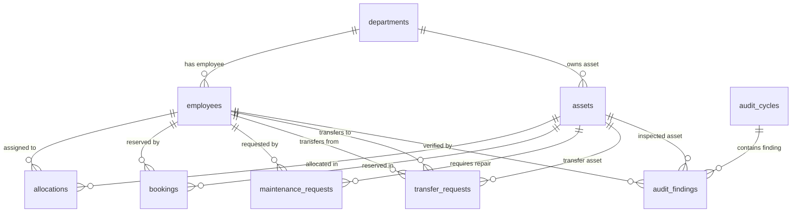

# Database Schema Design

This document outlines the PostgreSQL relational database schema for **AssetFlow**. 

---

## Entity Relationship Summary

---

## Table Definitions

### 1. `users` (Employee Directory)
Stores all user accounts, credentials, and organizational roles.
* `id` (UUID, Primary Key)
* `name` (VARCHAR, Not Null)
* `email` (VARCHAR, Unique, Not Null)
* `hashed_password` (VARCHAR, Not Null)
* `role` (VARCHAR, Not Null) — `admin`, `asset_manager`, `department_head`, `employee`
* `department_id` (UUID, FK -> `departments`, Nullable)
* `avatar_url` (VARCHAR, Nullable)
* `status` (VARCHAR, Not Null) — `active`, `inactive`
* `joined_at` (TIMESTAMP, Default NOW)

### 2. `departments`
* `id` (UUID, Primary Key)
* `name` (VARCHAR, Not Null)
* `code` (VARCHAR, Unique, Not Null)
* `head_id` (UUID, FK -> `users`, Nullable)
* `parent_id` (UUID, FK -> `departments`, Nullable)
* `status` (VARCHAR, Not Null) — `active`, `inactive`

### 3. `asset_categories`
* `id` (UUID, Primary Key)
* `name` (VARCHAR, Not Null)
* `description` (TEXT, Nullable)
* `status` (VARCHAR, Not Null) — `active`, `inactive`

### 4. `assets`
* `id` (UUID, Primary Key)
* `tag` (VARCHAR, Unique, Not Null) — format: `AF-0001`
* `name` (VARCHAR, Not Null)
* `category_id` (UUID, FK -> `asset_categories`, Not Null)
* `serial_number` (VARCHAR, Unique, Not Null)
* `department_id` (UUID, FK -> `departments`, Nullable)
* `assigned_to_id` (UUID, FK -> `users`, Nullable)
* `location` (VARCHAR, Not Null)
* `condition` (VARCHAR, Not Null) — `excellent`, `good`, `fair`, `poor`
* `status` (VARCHAR, Not Null) — `available`, `allocated`, `reserved`, `under_maintenance`, `lost`, `retired`, `disposed`
* `shared` (BOOLEAN, Default False) — Flag for bookable resources
* `acquisition_date` (DATE, Not Null)
* `acquisition_cost` (NUMERIC, Default 0)
* `notes` (TEXT, Nullable)
* `updated_at` (TIMESTAMP, Default NOW)

### 5. `allocations`
Tracks custody of specific assets.
* `id` (UUID, Primary Key)
* `asset_id` (UUID, FK -> `assets`, Not Null)
* `employee_id` (UUID, FK -> `users`, Not Null)
* `department_id` (UUID, FK -> `departments`, Nullable)
* `allocated_at` (TIMESTAMP, Default NOW)
* `expected_return_at` (TIMESTAMP, Nullable)
* `returned_at` (TIMESTAMP, Nullable)
* `return_condition` (VARCHAR, Nullable)
* `return_notes` (TEXT, Nullable)
* `status` (VARCHAR, Not Null) — `active`, `returned`, `overdue`
* `notes` (TEXT, Nullable)

### 6. `transfer_requests`
* `id` (UUID, Primary Key)
* `code` (VARCHAR, Unique, Not Null) — format: `TR-0001`
* `asset_id` (UUID, FK -> `assets`, Not Null)
* `from_employee_id` (UUID, FK -> `users`, Not Null)
* `to_employee_id` (UUID, FK -> `users`, Not Null)
* `reason` (TEXT, Not Null)
* `requested_by_id` (UUID, FK -> `users`, Not Null)
* `requested_at` (TIMESTAMP, Default NOW)
* `approver_id` (UUID, FK -> `users`, Nullable)
* `status` (VARCHAR, Not Null) — `requested`, `approved`, `rejected`, `completed`

### 7. `bookings`
Stores reservation slots for shared resources.
* `id` (UUID, Primary Key)
* `asset_id` (UUID, FK -> `assets`, Not Null)
* `booked_by_id` (UUID, FK -> `users`, Not Null)
* `department_id` (UUID, FK -> `departments`, Nullable)
* `start_at` (TIMESTAMP, Not Null)
* `end_at` (TIMESTAMP, Not Null)
* `purpose` (VARCHAR, Not Null)
* `attendees` (INTEGER, Nullable)
* `notes` (TEXT, Nullable)
* `status` (VARCHAR, Not Null) — `upcoming`, `ongoing`, `completed`, `cancelled`

### 8. `maintenance_requests`
* `id` (UUID, Primary Key)
* `code` (VARCHAR, Unique, Not Null) — format: `MR-0001`
* `asset_id` (UUID, FK -> `assets`, Not Null)
* `requested_by_id` (UUID, FK -> `users`, Not Null)
* `title` (VARCHAR, Not Null)
* `description` (TEXT, Not Null)
* `priority` (VARCHAR, Not Null) — `low`, `medium`, `high`, `critical`
* `status` (VARCHAR, Not Null) — `pending`, `approved`, `rejected`, `assigned`, `in_progress`, `resolved`
* `requested_at` (TIMESTAMP, Default NOW)
* `preferred_date` (DATE, Nullable)
* `technician_id` (UUID, FK -> `users`, Nullable)
* `estimated_cost` (NUMERIC, Nullable)
* `actual_cost` (NUMERIC, Nullable)
* `resolution_notes` (TEXT, Nullable)

### 9. `maintenance_history`
Maintains workflow change timeline per request.
* `id` (UUID, Primary Key)
* `request_id` (UUID, FK -> `maintenance_requests`, Not Null)
* `status` (VARCHAR, Not Null)
* `note` (TEXT, Nullable)
* `by_id` (UUID, FK -> `users`, Not Null)
* `changed_at` (TIMESTAMP, Default NOW)

### 10. `audit_cycles`
* `id` (UUID, Primary Key)
* `title` (VARCHAR, Not Null)
* `scope_department_id` (UUID, FK -> `departments`, Nullable)
* `scope_location` (VARCHAR, Nullable)
* `start_date` (DATE, Not Null)
* `end_date` (DATE, Not Null)
* `status` (VARCHAR, Not Null) — `draft`, `active`, `in_review`, `closed`
* `notes` (TEXT, Nullable)

### 11. `audit_assignments`
Assigns auditors to an audit cycle.
* `id` (UUID, Primary Key)
* `audit_cycle_id` (UUID, FK -> `audit_cycles`, Not Null)
* `auditor_id` (UUID, FK -> `users`, Not Null)

### 12. `audit_findings`
* `id` (UUID, Primary Key)
* `audit_cycle_id` (UUID, FK -> `audit_cycles`, Not Null)
* `asset_id` (UUID, FK -> `assets`, Not Null)
* `status` (VARCHAR, Not Null) — `pending`, `verified`, `missing`, `damaged`
* `notes` (TEXT, Nullable)
* `auditor_id` (UUID, FK -> `users`, Nullable)
* `verified_at` (TIMESTAMP, Nullable)

### 13. `notifications`
* `id` (UUID, Primary Key)
* `user_id` (UUID, FK -> `users`, Not Null)
* `type` (VARCHAR, Not Null) — `allocation`, `transfer`, `maintenance`, `booking`, `audit`, `overdue`
* `title` (VARCHAR, Not Null)
* `message` (TEXT, Not Null)
* `read` (BOOLEAN, Default False)
* `at` (TIMESTAMP, Default NOW)
* `link` (VARCHAR, Nullable)

### 14. `activity_logs`
* `id` (UUID, Primary Key)
* `user_id` (UUID, FK -> `users`, Not Null)
* `action` (VARCHAR, Not Null)
* `module` (VARCHAR, Not Null)
* `entity_id` (UUID, Nullable)
* `description` (TEXT, Not Null)
* `role` (VARCHAR, Not Null)
* `at` (TIMESTAMP, Default NOW)
* `status` (VARCHAR, Nullable)
